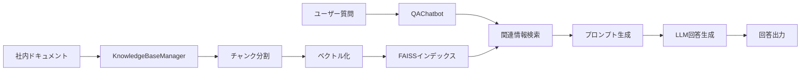

# RAG型社内QAチャットボット

RAG (Retrieval-Augmented Generation) アーキテクチャを使用した社内ドキュメント検索・回答システムです。社内の文書を知識ベースとして、従業員からの質問に自動で回答します。

## 🌟 特徴

- **RAGアーキテクチャ**: 検索と生成を組み合わせた高精度な回答システム
- **多様なLLM対応**: Hugging Face Transformers、Azure OpenAI API対応
- **高速検索**: FAISS による効率的なベクトル検索
- **日本語対応**: 日本語の社内文書に最適化
- **簡単セットアップ**: 軽量で導入しやすい設計

## 🏗️ システム構成



## 📂 ファイル構成

```
├── README.md                    # このファイル
├── .gitignore                   # Git除外設定
├── requirements.txt             # 基本版依存関係
├── requirements_azure.txt       # Azure版依存関係
├── .env.template               # 環境変数テンプレート
├── rag_qa_chatbot.py           # 基本版メイン実装
├── rag_qa_chatbot_azure.py     # Azure OpenAI版実装
├── test_rag_chatbot.py         # 包括的テストスイート
├── quick_test.py               # 軽量テスト
├── demo_light.py               # 軽量デモ
└── azure_demo.py               # Azure設定デモ
```

## 🚀 クイックスタート

### 1. 環境準備

```bash
# リポジトリをクローン
git clone <repository-url>
cd rag-qa-chatbot

# 仮想環境作成（推奨）
python -m venv venv
source venv/bin/activate  # Windows: venv\Scripts\activate

# 依存関係インストール
pip install -r requirements.txt
```

### 2. 基本版実行

```bash
# 軽量テストで動作確認
python quick_test.py

# 軽量デモ実行
python demo_light.py

# 完全版実行（モデルダウンロードあり）
python rag_qa_chatbot.py
```

### 3. Azure OpenAI版実行

```bash
# Azure用依存関係インストール
pip install -r requirements_azure.txt

# 環境変数設定
export AZURE_OPENAI_ENDPOINT='https://your-resource.openai.azure.com/'
export AZURE_OPENAI_API_KEY='your-api-key'

# Azure版実行
python rag_qa_chatbot_azure.py
```

## ⚙️ 設定方法

### 基本版設定

基本版はHugging Face Transformersを使用し、特別な設定は不要です。

### Azure OpenAI版設定

**方法1: 環境変数**

`.env.template`をコピーして`.env`として保存し、実際の値を設定：

```bash
AZURE_OPENAI_ENDPOINT=https://your-resource.openai.azure.com/
AZURE_OPENAI_API_KEY=your-32-character-api-key
AZURE_OPENAI_DEPLOYMENT=gpt-35-turbo
```

**方法2: コード内設定**

```python
chatbot = QAChatbotAzure(
    knowledge_base=kb_manager,
    azure_endpoint='https://your-resource.openai.azure.com/',
    api_key='your-api-key',
    deployment_name='gpt-35-turbo'
)
```

## 🔧 使用方法

### 基本的な使用例

```python
from rag_qa_chatbot import KnowledgeBaseManager, QAChatbot

# 1. ドキュメント準備
documents = [
    "経費精算の上限は月額50,000円です。",
    "有給休暇は入社6ヶ月後から取得可能です。"
]

# 2. ナレッジベース構築
kb_manager = KnowledgeBaseManager()
kb_manager.build_index(documents)

# 3. チャットボット初期化
chatbot = QAChatbot(kb_manager, company_name="株式会社AIシステム")

# 4. 質問と回答
answer = chatbot.answer("経費精算の上限はいくらですか？")
print(answer)
```

### Azure OpenAI版使用例

```python
from rag_qa_chatbot_azure import KnowledgeBaseManager, QAChatbotAzure

# ナレッジベース構築
kb_manager = KnowledgeBaseManager()
kb_manager.build_index(documents)

# Azure OpenAI チャットボット
chatbot = QAChatbotAzure(
    knowledge_base=kb_manager,
    azure_endpoint='your-endpoint',
    api_key='your-key',
    deployment_name='gpt-35-turbo',
    company_name='株式会社AIシステム'
)

# 質問と回答
answer = chatbot.answer("有給休暇について教えてください")
print(answer)
```

## 🧪 テスト

### テスト実行

```bash
# 軽量テスト（推奨）
python quick_test.py

# 包括的テスト
python test_rag_chatbot.py

# Azure版デモ
python azure_demo.py
```

### テスト内容

- ✅ ドキュメント分割機能
- ✅ プロンプト構築機能
- ✅ 回答生成機能
- ✅ 統合テスト
- ✅ パフォーマンステスト

## 📊 システム要件

### 最小要件

- Python 3.8+
- メモリ: 4GB RAM
- ストレージ: 2GB (モデルキャッシュ含む)

### 推奨要件

- Python 3.10+
- メモリ: 8GB RAM
- GPU: CUDA対応（オプション、高速化用）
- ストレージ: 5GB

## 🎛️ カスタマイズ

### チャンクサイズ調整

```python
kb_manager = KnowledgeBaseManager()
kb_manager.chunk_size = 300  # デフォルト: 500
kb_manager.overlap = 50      # デフォルト: 50
```

### 検索件数調整

```python
# 検索結果件数を変更
relevant_context = kb_manager.search(question, top_k=5)  # デフォルト: 3
```

### Embeddingモデル変更

```python
# 異なるEmbeddingモデルを使用
kb_manager = KnowledgeBaseManager(
    embedding_model_name="sentence-transformers/all-MiniLM-L6-v2"
)
```

## 🔍 トラブルシューティング

### よくある問題

**1. メモリ不足エラー**
```bash
# より軽量なモデルを使用
kb_manager = KnowledgeBaseManager(
    embedding_model_name="intfloat/multilingual-e5-small"
)
```

**2. Azure OpenAI接続エラー**
```bash
# 接続テスト実行
python -c "
from rag_qa_chatbot_azure import QAChatbotAzure
chatbot = QAChatbotAzure(None, company_name='株式会社AIシステム')
chatbot.test_connection()
"
```

**3. 日本語処理の問題**
```python
# 文字エンコーディング確認
with open('document.txt', 'r', encoding='utf-8') as f:
    content = f.read()
```

### ログとデバッグ

```python
import logging
logging.basicConfig(level=logging.DEBUG)
```

