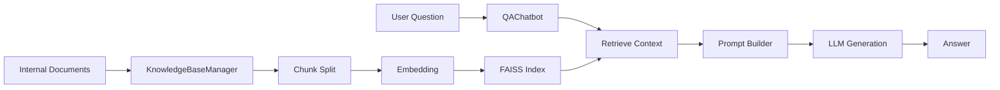

# RAG-Style Internal QA Chatbot

This project provides a document retrieval and question answering system based on the Retrieval-Augmented Generation (RAG) architecture. Company documents are indexed as a knowledge base so that employees can ask questions and receive automatic answers.

## 🌟 Features

- **RAG Architecture**: Combines retrieval and generation for accurate answers
- **Multiple LLM Providers**: Works with Hugging Face Transformers, Azure OpenAI, and AWS Bedrock
- **Fast Search**: Efficient vector search powered by FAISS
- **Japanese Support**: Optimised for Japanese internal documents
- **Easy Setup**: Lightweight design for quick adoption

## 🏗️ System Architecture



## 📂 Project Structure

```
├── README.md              # Japanese README
├── README_en.md           # This file
├── .gitignore             # Git ignore settings
├── requirements.txt       # Basic dependencies
├── requirements_azure.txt # Azure specific deps
├── .env.template          # Environment variable template
├── rag_qa_chatbot.py      # Main implementation (multi-provider)
├── rag_qa_chatbot_azure.py# Legacy Azure implementation
├── test_rag_chatbot.py    # Comprehensive tests
├── quick_test.py          # Lightweight tests
├── demo_light.py          # Lightweight demo
└── azure_demo.py          # Azure demo script
```

## 🚀 Quick Start

### 1. Environment Setup

```bash
# Clone repository
git clone <repository-url>
cd qa-bot-azure

# Create virtual environment (recommended)
python -m venv venv
source venv/bin/activate  # Windows: venv\Scripts\activate

# Install dependencies
pip install -r requirements.txt
```

### 2. Local Execution

```bash
# Run lightweight tests
python quick_test.py

# Run lightweight demo
python demo_light.py

# Full demo (downloads models)
python rag_qa_chatbot.py
```

### 3. Azure OpenAI Execution

```bash
pip install -r requirements_azure.txt

export AZURE_OPENAI_ENDPOINT="https://your-resource.openai.azure.com/"
export AZURE_OPENAI_API_KEY="your-api-key"

python rag_qa_chatbot.py --provider azure --deployment_name gpt-35-turbo
```

### 4. AWS Bedrock Execution

```bash
pip install boto3

# Set credentials if not already configured via AWS CLI
export AWS_ACCESS_KEY_ID="your-access-key"
export AWS_SECRET_ACCESS_KEY="your-secret-key"
export AWS_REGION="us-east-1"

python rag_qa_chatbot.py --provider aws --model_id amazon.titan-text-lite-v1
```

## ⚙️ Configuration

### Basic Version
Uses Hugging Face Transformers and requires no special settings.

### Azure OpenAI
Use environment variables (`AZURE_OPENAI_ENDPOINT`, `AZURE_OPENAI_API_KEY`, `AZURE_OPENAI_DEPLOYMENT`) or pass parameters to `QAChatbot`.

### AWS Bedrock
Credentials can be supplied via the AWS CLI or passed directly to `QAChatbot` using `region_name` and `model_id`.

## 🔧 Usage

```python
from rag_qa_chatbot import KnowledgeBaseManager, QAChatbot

kb_manager = KnowledgeBaseManager()
kb_manager.build_index(documents)

chatbot = QAChatbot(kb_manager, provider="aws")
answer = chatbot.answer("Tell me about paid leave")
print(answer)
```

## 🧪 Tests

```bash
python quick_test.py
python test_rag_chatbot.py
```

## 📊 System Requirements

- Python 3.8+
- Memory: 4GB+ recommended

## 🎛️ Customisation

- Adjust chunk size via `kb_manager.chunk_size`
- Change number of retrieved passages with `kb_manager.search(question, top_k=5)`
- Use different embedding models through `KnowledgeBaseManager(embedding_model_name="sentence-transformers/all-MiniLM-L6-v2")`

## 🔍 Troubleshooting

- **Memory errors**: Try a smaller embedding model like `intfloat/multilingual-e5-small`
- **Azure errors**: Run connection test via `QAChatbot(..., provider="azure").client`
- **Encoding issues**: Open files with `encoding='utf-8'`

---

This project aims to provide a simple yet extensible foundation for internal Q&A chatbots that work both locally and across major cloud providers.
